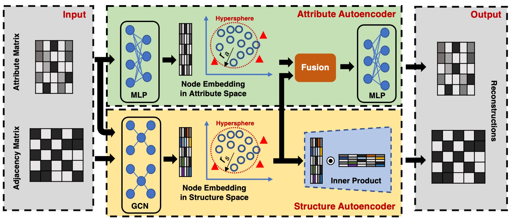

# Deep Dual Support Vector Data Description for Anomaly Detection on Attributed Networks


**Abstract:** Networks are ubiquitous in the real world such as social networks and communication networks, and anomaly detection on networks aims at finding nodes whose structural or attributed patterns deviate significantly from the majority of reference nodes. However, most of the traditional anomaly detection methods neglect the relation structure information among data points and therefore cannot effectively generalize to the graph structure data. In this paper, we propose an end-to-end model of Deep Dual Support Vector Data description based Autoencoder (Dual-SVDAE) for anomaly detection on attributed networks, which considers both the structure and attribute for attributed networks. Specifically, Dual-SVDAE consists of a structure autoencoder and an attribute autoencoder to learn the latent representation of the node in the structure space and attribute space respectively. Then, a dual-hypersphere learning mechanism is imposed on them to learn two hyperspheres of normal nodes from the structure and attribute perspectives respectively. Moreover, to achieve joint learning between the structure and attribute of the network, we fuse the structure embedding and attribute embedding as the final input of the feature decoder to generate the node attribute. Finally, abnormal nodes can be detected by measuring the distance of nodes to the learned center of each hypersphere in the latent structure space and attribute space respectively. Extensive experiments on the real-world attributed networks show that Dual-SVDAE consistently outperforms the state-of-the-arts, which demonstrates the effectiveness of the proposed method.




## Code and data will be released soon!

## Requirements

* Python 3.6
* Torch version 1.4


### Cite
If you make use of this code in your own work, please cite our paper.
```
@article{zhang2021deepdual,
  title={Deep Dual Support Vector Data Description for Anomaly Detection on Attributed Networks},
  author={Zhang, Fengbin and Fan, Haoyi and Wang, Ruidong and Li, Zuoyong and Liang, Tiancai
},
  booktitle={International Journal of Intelligent Systems},
  year={2021},
  publisher={Wiley}
}
```